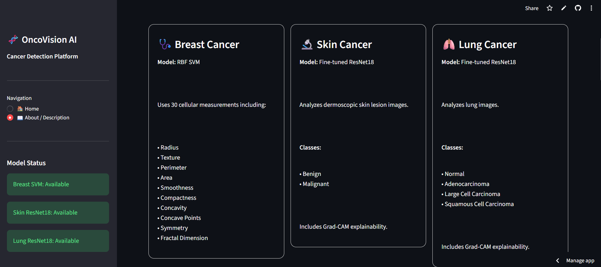

# 🧬 OncoVision AI

### Multi-Cancer Detection & Prediction using Machine Learning and Deep Learning

OncoVision AI is a machine learning and deep learning based application designed to demonstrate cancer classification using different types of medical data.

The project combines traditional Machine Learning and Convolutional Neural Networks (CNNs) into a single Streamlit application.

> ⚠️ **Medical Disclaimer:** This project is developed for educational and research purposes only. It is not a medical diagnostic tool and should not be used to make medical decisions.

---

## 🚀 Live Demo

🔗 **Streamlit App:**  
https://oncovision-ai-6fy5xzsepfxiappwvzl7uss.streamlit.app/

---

## 📌 Project Overview

OncoVision AI currently supports three cancer-related prediction modules:

| Module | Input | Model |
|---|---|---|
| 🩺 Breast Cancer | Tabular medical features | SVM |
| 🔬 Skin Cancer | Skin lesion image | ResNet18 |
| 🫁 Lung Cancer | Lung CT/X-ray image | ResNet18 |

The application provides a simple web interface where users can select a cancer module and submit the required input.

---
## 📸 OncoVision AI — Application Screenshots

### 🧬 Cancer Detection Interface

Users can upload medical images and use the trained deep-learning models for cancer classification.


---

### 🔥 Prediction & Grad-CAM Explainability

OncoVision AI provides the predicted class, confidence score, class probabilities, and Grad-CAM visualization to highlight regions that influenced the model prediction.


---

### ℹ️ About OncoVision AI

The About section explains the project architecture, supported cancer detection modules, technologies, and workflow.



# 🧠 Machine Learning Pipeline

The project follows a complete machine learning workflow:

```text
Data Collection
      ↓
Exploratory Data Analysis
      ↓
Data Cleaning
      ↓
Preprocessing
      ↓
Feature Engineering
      ↓
Feature Selection
      ↓
Model Training
      ↓
Model Evaluation
      ↓
Model Saving
      ↓
Streamlit Deployment
